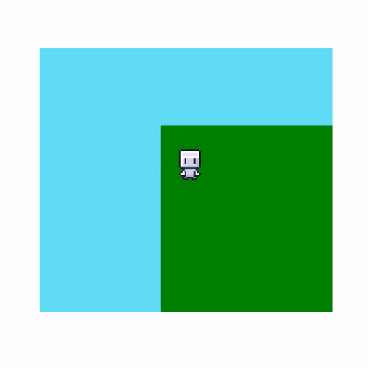
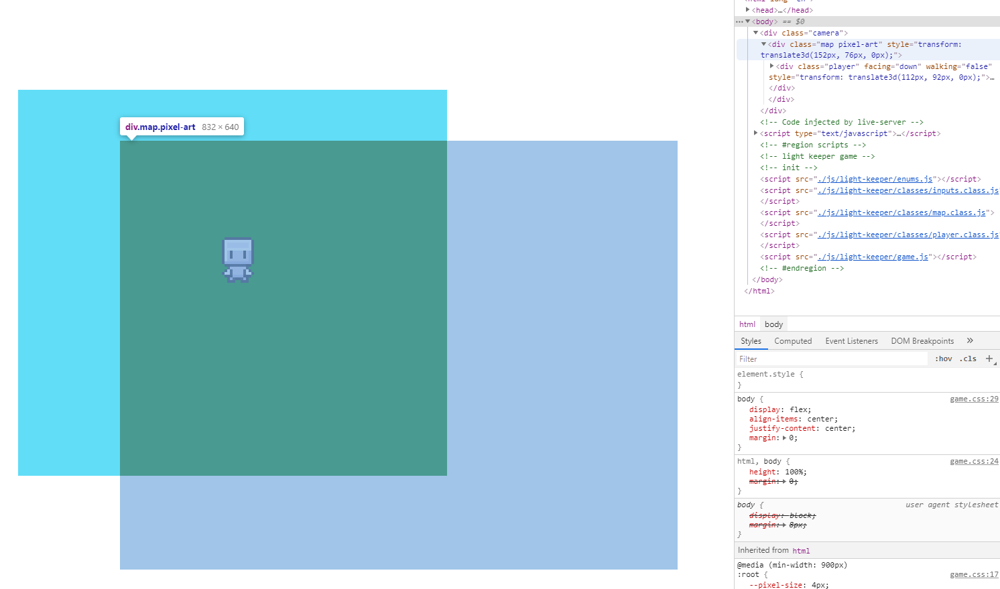

# Light Keeper (JS)

**A Game by Pike & Pen:**
- Wyatt H Williams: Code, Gameplay Design, Sprite/Tile Art
- Jacob Murphy: Writing/Worldbuilding, Map Design

**Special Thanks:**
- [Zaebucca](https://twitter.com/zaebucca) for inspiring the artstyle and for a small number of sprites *(which I ripped from Zaebucca's work on Jhoto Redrawn - W.W.)*


## Goal:

Create a game using only vanilla JS, HTML5, and CSS in 6-12 weeks. No external libraries.

**Story?:**

Play as someone in a small village tasked with lighting candles for the dead at night. Lighting each candle lets you read about the dearly departed's life.

The player's candle will dynamically light up the night as they walk around and explore.


## Outline/Todo Sheet:

**Basic Map Stuff:**
- [X] Top down camera, Player sprite animation, Player movement w/ animation
- [X] Tilemap system
- [X] Sprite-based Tiling (tile-sets)
- [ ] Auto-tiling tesselation
- [X] Player collision

**Lighting**
- [ ] Area Lighting
- [ ] Directional Lighting

**Dialouge**
- [ ] Pop-up box
- [ ] Writing text to pop-up box
- [ ] Dialouge box (npc talking)
- [ ] Cinematic Mode (disable inputs);

**Sound**
- [ ] Music Player System
- [ ] Volume Options
- [ ] Foley Sound System


## Devlog:

### Week 1:

<details>
    <summary>
    Top-Down-Movement complete!
    </summary>
    


**How It Was Made:**

After following [this very useful tutorial](https://www.youtube.com/watch?v=H3Fn33lYuE0&ab_channel=DrewConley) to the letter, I re-wrote the code for better readability and seperated out concerns. I also conformed to some organizational best-practices for game development.

The trick to the whole system is using JS to translate the absolutaly fixed player and map elements as you move around. The player never really moves, we actually move the map opposite of the player's input, and then re-draw the player in proper relation to the moved map. The "camera" then hides the overflow, which gives the illusion of player movement!



I seperated input logic, map logic, and player logic into their own classes. This will improve git flow as things get more complicated, but also keep things manageable and tidy-clean for me.

In game development, you also seperate out the different "phases" of each animation step. This mainly has to do with the way game engines run, but for our purposes it does help to keep everything as modular as possible.Therefor I seperated out the draw phase and input handing phases of each game step, with the respective logic also seperated.

```javascript
// ========== [///// GAME LOOP /////] ==========
const step = () => {
    // ----- event phase -----
    player.handleMovement();

    // ----- draw phase -----
    player.drawSelf();
    map.drawSelf();

    // ----- next step -----
    window.requestAnimationFrame(() => {
        step();
    })
}
```

</details>

<details>
    <summary>
    The Tile-Map!
    </summary>
    
Why a tile map? By using a tile map I can set myself up for doing cool stuff later with tesselation, sprite animations as part of the terrain, and really really cool stuff involving z-depth(for walking behind objects or seeing if the player is on a hill). Additionaly, my plan for doing some nifty dynamic lighting later involves using a tile based system.

**Basic Tiling**

But first, I don't want to draw every map and then translate it to code every time I need to make a change. My goal is to give the program an array of basic tile information (ie. put grass here, stone floor here, the foundation of a building here) and then let the code figure out tesselation, animations, and extra decorations on its own. Most importantly, I will need to be able to check what kind of tile the floor is periodically, and I want to have the ability to change that floor tile at any time.

Let's start withh the floor tiles. I know that later there will need to have different tile layers for objects, decorations, and special lighting tiles. But for now, let's just make sure we can take in an array of tile data and put all the tiles in the right spot.

some sample map data for us:
```javascript
const testMapData = {
    widthInTiles: 3,
    heightInTiles: 3,
    tileData: [
        { x: 0, y: 0, layer: "floor", type: "sidewalk" },
        { x: 0, y: 1, layer: "floor", type: "sidewalk" },
        { x: 0, y: 2, layer: "floor", type: "sidewalk" },

        { x: 1, y: 0, layer: "floor", type: "sidewalk" },
        { x: 1, y: 1, layer: "floor", type: "grass" },
        { x: 1, y: 2, layer: "floor", type: "sidewalk" },

        { x: 2, y: 0, layer: "floor", type: "sidewalk" },
        { x: 2, y: 1, layer: "floor", type: "sidewalk" },
        { x: 2, y: 2, layer: "floor", type: "sidewalk" },
    ]
}
```


Ok, but why not just a 2d array that stores a bunch of objects? Really just for quick look-ups later down the line. I know this data isn't usually the data we'll be looking at, but either way I like this.

And groovy goomba! After adding some map-gen funcs to our map class:


But these tiles are just divs with a css background color. What about selecting tiles from a tileset??

**Tileset-Based Tiling**

For this we use the same css that we used for managing the player's spritesheet: we set a child div inside the tile with a background of the tileset, then change the background x and y depending on what tile we want. In JS, we use our tile data to assign the classes related to all this.

```javascript
makeTile(tile) {
    // ----- make the elements -----
    let newTile = document.createElement("div");
    let newTileset = document.createElement("div");
    let mapLayer = this.element.querySelector(`.tile-layer.${tile.layer}`);

    // ----- assign tile class -----
    newTile.classList.add("tile")

    // ----- position the tile -----
    newTile.style.top = `${tile.y * renderer.tileSize}px`;
    newTile.style.left = `${tile.x * renderer.tileSize}px`;

    // ----- assign tileset class -----
    newTileset.classList.add(`${tile.type}`)

    // ----- finish and add to map -----
    newTile.append(newTileset);
    mapLayer.append(newTile);
}
```

After using this with a new "sidewalk" class we get this:


Then! for artistic reasons, lets use the extra sidewalk tiles I made as variations. A little method here:

```javascript
makeTile(tile) {
    ***

    // ----- set tile variation -----
    /*  this is a class that moves the background
    *   to a specific tile in the set
    */
    if (tile.variation == true) {
        let vNum = Math.floor(Math.random() * 3 + 1);
        newTileset.classList.add(`v-${vNum}`);
    }

    ***
}
```

And a little css there:

```css
/* ========== VARIATIONS ========== */
/* ----- sidewalk ----- */
.sidewalk.v-1 {
    background-position-x: calc( var(--pixel-size) * 0);
}
.sidewalk.v-2 {
    background-position-x: calc( var(--pixel-size) * -8);
}
.sidewalk.v-3 {
    background-position-x: calc( var(--pixel-size) * -16);
}
```

boom:


**NOTE:** I also did a pretty fun stress-test to see how many fully-tiled layers I could have on-screen at a time before the browser quit. Which was a suprisingly high number. Then I tested the browser's limits with setting each of those tiles to have it's own sprite animation. Again, a surprisingly high limit(that i'm sure also heavily depends on your computer's gusto as well as the browser). The result of many many 8pixel tiles all animating at once was pretty trippy, unfortunately I forgot to take a screenshot before I moved on. (I was also a fool and deleted the branch ...)

</details>

<details>
    <summary>
    Player Collisions!
    </summary>


**How'd it done?**

Easy! First, I attatched a div with a new "collision-box" class to our player with the following css:

```css
.collision-box {
   z-index: 999;
   position: absolute;
   background: red;
   opacity: 0;
}
```

(I change the opacity to 0.75 whenever I need to see where the box is!)

Next I made a new entry on our testing tilemap that looks like this:

```javascript
{ x: 5, y: 5, layer: "obj", type: "shrine", variation: false },
```

This entry is for a "shrine" tile to be set onto the "obj" layer of our map div. Just like with floor tiles, we look at the x,y values, make a new tile div and then translate the tile on the map accordingly.

However, the shrine object that I drew is actually 2 tiles tall. I only want the player to collide with the bottom tile of the shrine though. So I'll put the bottom tile in the "obj" layer and the top tile on the "obj-deco" layer. I'll go over the "obj-deco" and "floor-deco" layers when I get to auto-tiling tesselation. But for now, just know that it won't look like a shrine in game for now:


Next we use a cool algorithm to detect if two rectangles are touching/overlaping:

```javascript
collisionDirection(r1, r2) {
        let dx = (r1.x + r1.width / 2) - (r2.x + r2.width / 2);
        let dy = (r1.y + r1.height / 2) - (r2.y + r2.height / 2);
        let width = (r1.width + r2.width) / 2;
        let height = (r1.height + r2.height) / 2;
        let crossWidth = width * dy;
        let crossHeight = height * dx;

        if (Math.abs(dx) <= width && Math.abs(dy) <= height) {
            if (crossWidth > crossHeight) {
                return (crossWidth > (-crossHeight)) ? 'up' : 'right';
            } else {
                return (crossWidth > -(crossHeight)) ? 'left' : 'down';
            }
        }
    }
```

and we attatch it as a static method to our brand-new physics class (just for clean organization).

Finally, we need to use this method inside the player movement method. What we want to know is if our player's collision-box is touching any tile that belongs to our "obj" layer. We then want to get the direction of the player's side that's touching and prevent movement in that direction. To FURTHER complicated things, we don't want to detect if the player is already colliding, we need to know if they will collide.

Therfore, we're going to

1) copy the player's collision box position data into "projectedPlacement"

```javascript
// "this" refers to player
let projectedPlacement = this.collisionBox.getBoundingClientRect();
```

2) check the input direction and add the speed. BUT we're going to add the speed to the projected placement instead of the player's position. Now the data in projected placement reflects where the player wants to move to.

```javascript
if (held_direction) {
            switch (held_direction) {
                // for each direction
                case DIRECTIONS.right:
                    projectedPlacement.x += this.speed;
                    // other code etc. past this point ...
```

3) call for collision detection

```javascript
if (held_direction) {
            switch (held_direction) {
                // for each direction
                case DIRECTIONS.right:
                    projectedPlacement.x += this.speed;
                    if (!checkForCollision(projectedPlacement).includes(held_direction)) {
                        this.x += this.speed;
                    }
                    break;
                    // other code etc. past this point ...
```

4) here's our collision check method, which loops through all "objects" on the map and if there's a collision, the physics collision algo will return which direction is colliding and we'll add that to our list of collisions:

```javascript
function checkForCollision(projection) {
            // ----- list for mult. collision directions -----
            let collisionList = [];
            let collision = undefined;

            // ----- check map objects -----
            for (let key in map.tiles.obj) {
                collision = Physics.collisionDirection(
                    projection,
                    map.tiles.obj[key].element.getBoundingClientRect()
                )
                if (collision) collisionList.push(collision);
            }

            return collisionList;
        }
```

**NOTE:** we can totally optimize this later!

5) then this bit of code (as seen in step 3) will only move the player if the held direction is not found in the collisions list!

```javascript
// "this" refers to player
if (!checkForCollision(projectedPlacement).includes(held_direction)) {
    this.x += this.speed;
}
```

I gotta say. I'm really proud of myself for this one. For example, I store the collision directions in a list so that the player can know it's colliding with more than one thing at a time. There are so many little neat tricks that I had to figure out to make this whole process work correctly.

</details>

### Week 2:

<details>
    <summary>
    Documentation Fun Times!
    </summary>

Ok, so this week was really about fixing my git flow and actually documenting what I was doing. The devlog up to this point wasn't written and I MAJORLY screwed up my repo to the point where I just started over.

There are no other entries for week 2 because I didn't have time for much else besides fixing my messy, messy mess.

On the flip side, I'm getting really good git practice in!

</details>

### Week 3: